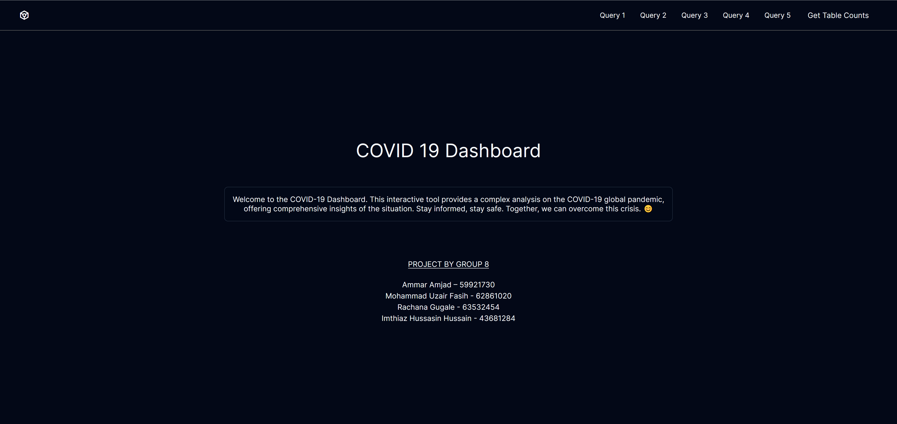
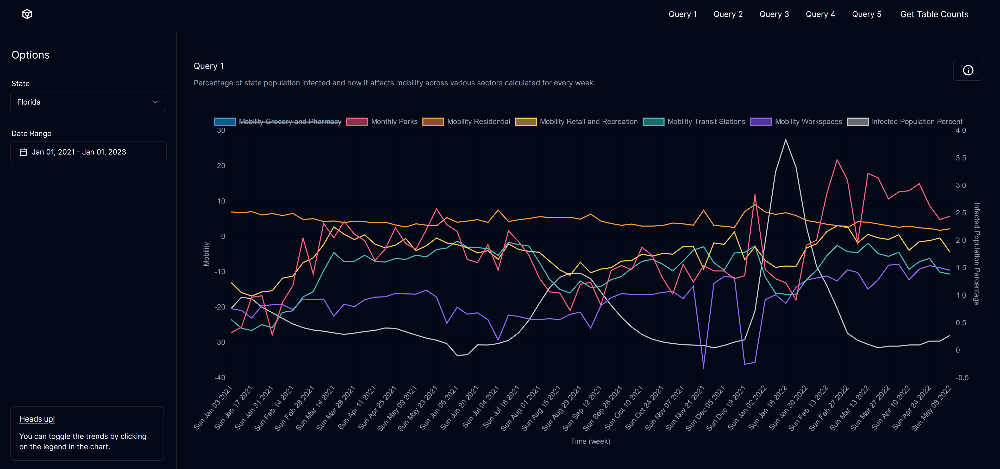
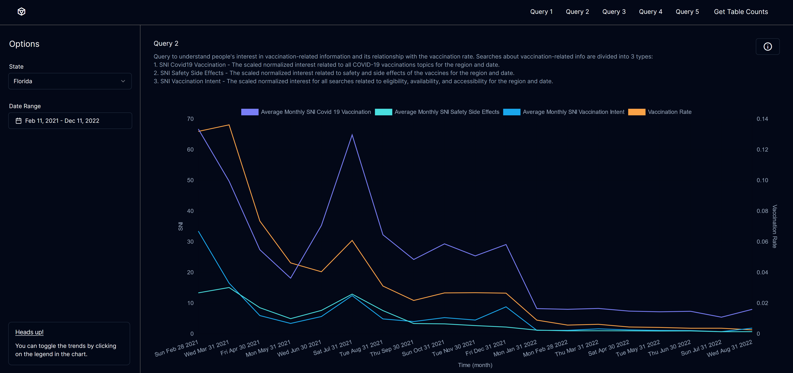
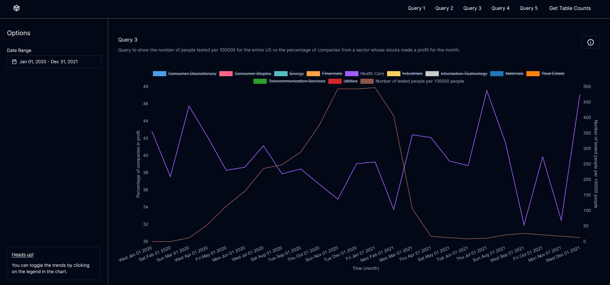
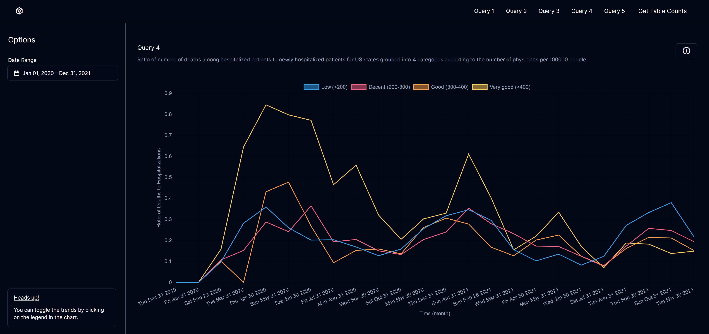
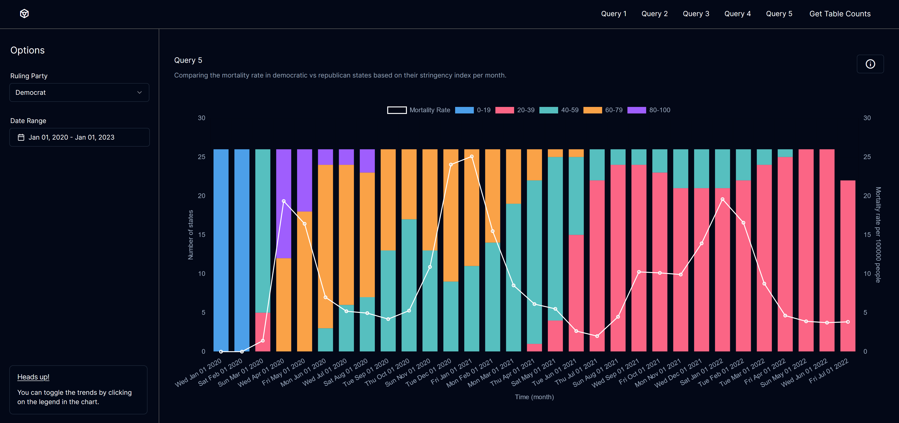
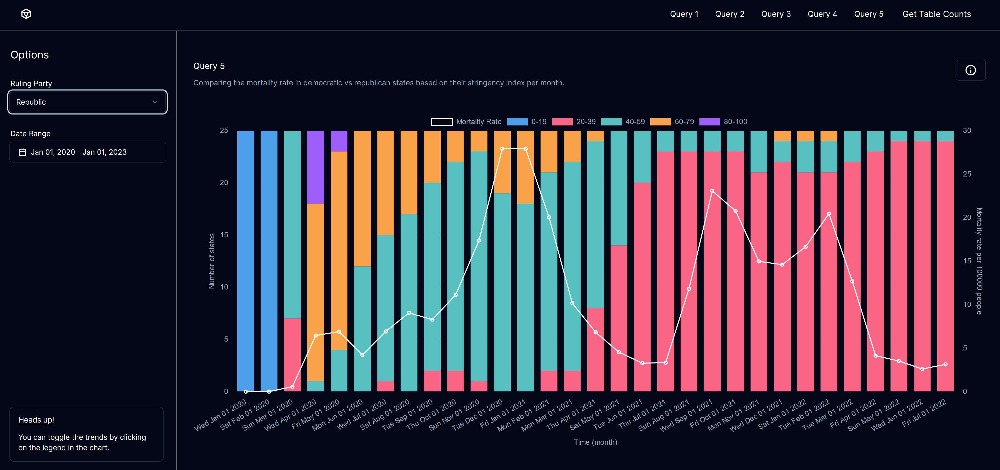
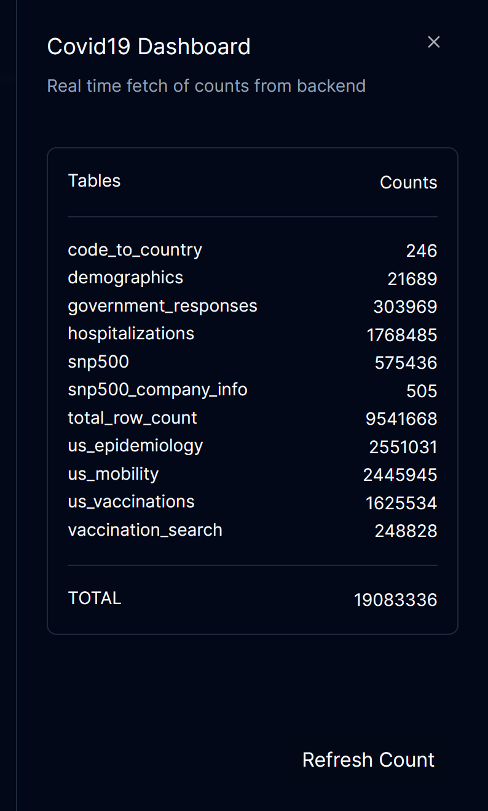

# Covid Trend Analysis

- A webapp to visualize and explore trends in covid data and how it various across states, political affiliations and time.
- Tech stack used:
  - React: For frontend
  - ChartJS: For graphs
  - Flask: For creating REST APIs
  - OracleDB: Database
- The main goal of this project was to learn how to write complex but optimized SQL queries for efficient processing of huge amount of data (19 million records).

Homepage:

## Query 1

_Percentage of state population infected and how it affects mobility across various sectors calculated for every week._

#### Mobility types:

- **mobility_grocery_and_pharmacy** - Percentage change in visits to places like grocery markets, food warehouses, farmers markets, specialty food shops, drug stores, and pharmacies compared to baseline.
- **mobility_parks** - Percentage change in visits to places like local parks, national parks, public beaches, marinas, dog parks, plazas, and public gardens compared to baseline.
- **mobility_transit_stations** - Percentage change in visits to places like public transport hubs such as subway, bus, and train stations compared to baseline.
- **mobility_retail_and_recreation** - Percentage change in visits to restaurants, cafes, shopping centers, theme parks, museums, libraries, and movie theaters compared to baseline.
- **mobility_residential** - Percentage change in visits to places of residence compared to baseline.
- **mobility_workplaces** - Percentage change in visits to places of work compared to baseline.

The baseline is the median value, for the corresponding day of the week.

## Query 2

_Query to understand people's interest in vaccination-related information and its relationship with the vaccination rate._

Searches about vaccination-related info are divided into 3 types:

1. **SNI Covid19 Vaccination** - The scaled normalized interest related to all COVID-19 vaccinations topics for the region and date.
2. **SNI Safety Side Effects** - The scaled normalized interest related to safety and side effects of the vaccines for the region and date.
3. **SNI Vaccination Intent** - The scaled normalized interest for all searches related to eligibility, availability, and accessibility for the region and date.

- Helps in understanding of the dynamics surrounding vaccination efforts.
- Monitoring "general_vaccine_interest" helps gauge overall public awareness.
- "vaccination_intent_interest" indicates the population's willingness to get vaccinated.
- Simultaneously, tracking "safety_side_effects_interest" assists in addressing concerns related to vaccine safety.
- By correlating these trends with vaccination rates, policymakers can tailor communication strategies, targeting areas with low intent or high safety concerns.
- The data also enables rapid response to emerging issues, supports predictive modeling, and allows for informed allocation of resources, ultimately aiding in fostering vaccination uptake and addressing hesitancy effectively.

## Query 3

_Query to show the number of people tested per 100000 for the entire US vs the percentage of companies from a sector whose stocks made a profit for the month._

## Query 4

_Ratio of number of deaths among hospitalized patients to newly hospitalized patients for US states grouped into 4 categories according to the number of physicians per 100000 people._

- Our analysis looks at the number of deaths and new hospitalizations in different states. This ratio, called the 'D:H ratio,' helps us gauge the immediate outcome of hospital care.
- We've grouped states into four categories based on the number of physicians per 100,000 people: Low, Decent, Good, and Very Good. This grouping is crucial for understanding variations in the D:H ratio with different healthcare resource levels.
- Expectations vs reality:
  - While common belief suggests a simple inverse correlation — more physicians leading to fewer deaths relative to hospitalizations — our data tells a more complex story.
  - We can see that the D:H ratio is higher for the 'Very Good' category than for the other categories. While for the other 3 categories ('Low', 'Decent', 'Good'), their D:H ratio values are very similar to each other.
  - The initial peak in D:H values between Mar20-Jun20 suggests that the medical community wasn’t properly equipped to handle a pandemic.
    The other peaks probably indicate next covid waves.
- Inference:
  - These variations suggest that physician numbers alone don't determine patient outcomes. Other factors, like the quality of medical resources, access to essentials like oxygen, the responsiveness of the healthcare system to surges in hospitalization also play a pivotal role and probably overshadow the positive effects that having a higher number of physicians would have had on the D:H ratio.
  - The graph, when considered in conjunction with other healthcare resource, demographic, and economic metrics can be used to make policy decisions like allocation of healthcare resources and medical personnel.

## Query 5

_Comparing the mortality rate in democratic vs republican states based on their stringency index per month._

**Democrat:**

**Republican:**

- Query: Comparing mortality rates in democratic vs. republican states based on their monthly stringency index.
  Usefulness: Correlating stringency indices with mortality rates provides a visual tool to assess the effectiveness of measures across states with different political leanings.
- Objective: Drawing comparisons based on two parameters:
  Number of states categorized by their Stringency Index.
  Aggregate mortality rate trends in Democratic versus Republican states.
- Temporal Trends:
  Mortality peaks and troughs at different points.
  Stringency index varies over time, reflecting evolving policy responses to the pandemic.
- Stringency Index Analysis:
  - Stringency peaks after mortality rate increases, suggesting reactive policy tightening.
  - Lower stringency indices don't always correspond with higher mortality rates, indicating other factors at play.
- Mortality Rate Analysis:
  - Mortality rates appear cyclical, reflecting waves of COVID-19 infections.
  - Noticeable decrease in mortality rates in the latter half of 2021, possibly linked to vaccination rollouts and improved treatment protocols.
- Differences Between Political Leaning:
  - Democratic states show a trend with higher stringency indices (40-100) more common.
  - Republican states exhibit lower stringency indices (0-39) more frequently, suggesting a more relaxed policy approach.
- Critical Analysis and Conclusion:
  - Visual trends suggest a relationship between policy stringency and mortality outcomes, but a direct causal link cannot be asserted.
  - Consideration of demographic variations, healthcare infrastructure, and public compliance is crucial in policy decisions.

## Count Query

_Query for fetching the number of records in the entire dataset in real time._

